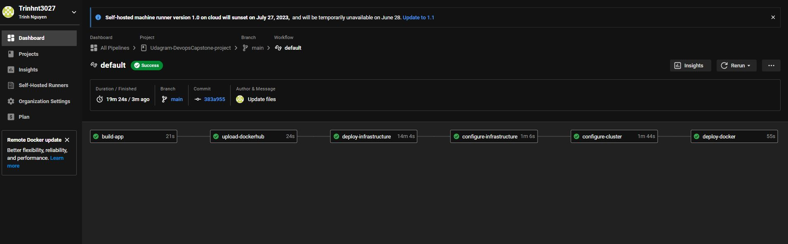
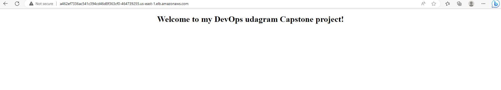

# Udagram-DevopsCapstone-project
This is capstone of devops udacity for DevOps udacity

## Application overview
This capstone project uses Python and Flask framework to create basic web page that users can access via web browser.

- Application: Python + Flask
- Applicaion container using docker
- Cloudformation to deploy AWS resource
- Ansible to config resource
- Kubenrnetes cluster building
- AWS environment

## Resource components
- Networking: VPC, Security group, subnet,...
- EKS cluster + Node group to deploy app
- Management server to configure and manage for EKS cluster

## CircleCI Pipeline

## Web URL: http://a462ef7336ac541c394cd46d8f363cf0-464739255.us-east-1.elb.amazonaws.com/

